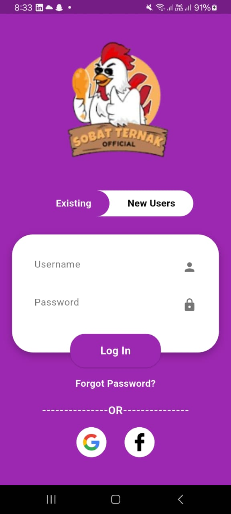
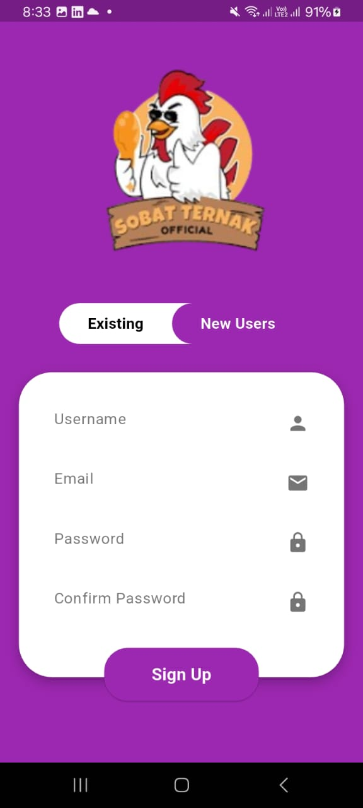
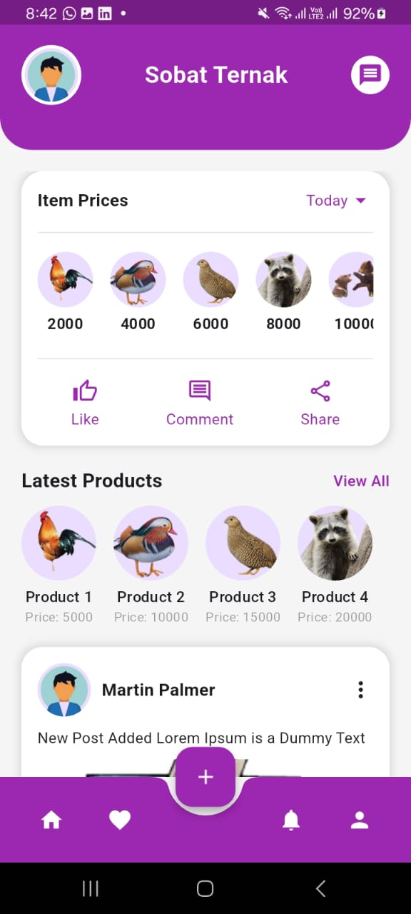

# 🐄 Sobat Ternak - Flutter App

Sobat Ternak is a modern and clean Flutter UI for a livestock companion app. It features real-time item price tracking, community posts, and a sleek user interface optimized for farmers and animal sellers.

---

## 📱 Screenshots

| Home Screen                       | Price Container                    | Post Section                      |
|-----------------------------------|------------------------------------|-----------------------------------|
|  |  |  |

---

## 🚀 Features

- 🌟 Clean and modern UI using Material Design.
- 📦 Scrollable product list with dynamic pricing.
- 💬 Community feed with user posts.
- 📲 Responsive design for small screens.
- ⚡️ Custom circular FloatingActionButton.
- 🌈 Themed purple top bar and navigation bar.

---

